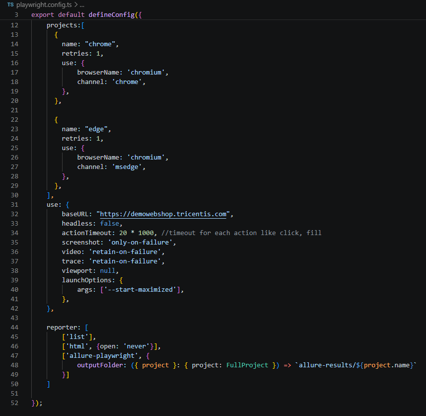
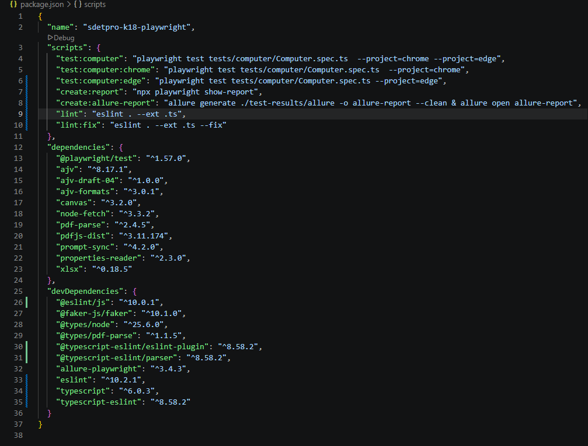

# PlaywrightFramework

Playwright TypeScript Automation Framework

## Playwright Introduction

* Playwright is a framework for Web Testing and Automation. It allows testing Chromium, Firefox and WebKit with a single API. Playwright is built to enable cross-browser web automation that is ever-green, capable, reliable and fast. Headless execution is supported for all browsers on all platforms.
* As Playwright is written by the creators of the Puppeteer, you would find a lot of similarities between them.
* Playwright has its own test runner for end-to-end tests, we call it Playwright Test.
* Cross-browser. Playwright supports all modern rendering engines including Chromium, WebKit, and Firefox.
* Cross-platform. Test on Windows, Linux, and macOS, locally or on CI, headless or headed.
* Cross-language. Use the Playwright API in TypeScript, JavaScript, Python, .NET, Java. The core framework is implemented using TypeScript.
* Playwright development is sponsored by Microsoft.

[GitHub](https://github.com/microsoft/playwright)
[Documentation](https://playwright.dev/docs/intro)
[API reference](https://playwright.dev/docs/api/class-playwright/)
[Changelog](https://github.com/microsoft/playwright/releases)

# Playwright - Framework

This is an automation framework using Playwright written in TypeScript.

## Framework Structure

```
├── constants/                                        
│   ├── names.ts                                      # Name-related constants
│   ├── slugs.ts                                      # Slug-related constants
│   └── timeout.ts                                    # Timeout values
├── labs/                                            
│   ├── lab11/                                       
│   │   ├── Post.js                                   # Handles Post operations
│   │   ├── RequestHandler.js                         # Manages HTTP requests
│   │   └── TestPostModel.js                          # Test model for Post
│   └── lab2/ to lab17/                               # Additional lab exercises
├── models/                                          
│   ├── components/                                  
│   │   ├── PageBodyComponent.ts                      # Component for page body
│   │   ├── ProductEssentialComponent.ts              # Essential product component
│   │   ├── ProductItemComponent.ts                   # Product item component
│   │   └── checkout/                                
│   │       ├── BillingAddressComponent.ts            # Billing address form
│   │       ├── ConfirmOrderComponent.ts              # Order confirmation
│   │       ├── PaymentInformationComponent.ts        # Payment information form
│   │       ├── PaymentMethodComponent.ts             # Payment method selection
│   │       ├── ShippingAdressComponent.ts            # Shipping address form
│   │       └── ShippingMethodComponent.ts            # Shipping method selection
│   ├── computer/                                    
│   │   ├── CheapCompEssComponent.ts                  # Component for cheap computers
│   │   ├── ComputerEssentialComponent.ts             # Essential computer component
│   │   ├── ExpensiveCompEssComponent.ts              # Component for expensive computers
│   │   └── StandardCompEssComponent.ts               # Component for standard computers
│   ├── globals/                                     
│   │   ├── footer/                                  
│   │   │   ├── CustomerServiceColumnComponent.ts     # Customer service column
│   │   │   ├── FooterColumnComponent.ts              # Footer column
│   │   │   ├── FooterComponent.ts                    # Footer component
│   │   │   └── InformationColumnComponent.ts         # Information column
│   │   └── header/                                  
│   │       └── HeaderComponent.ts                    # Header component
│   └── shoppingCart/                                
│           ├── CartItemRowComponent.ts               # Shopping cart item row
│           └── TotalsComponent.ts                    # Shopping cart totals
├── playwright-report/                               
│   └── index.html                                    # Playwright test report
├── test_data/                                       
│   ├── ComputerDataType.ts                           # Type definitions for computer data
│   ├── defaultCheckoutCard.json                      # Default checkout card data
│   ├── defaultCheckoutUser.json                      # Default checkout user data
│   └── computer/                                   
│       ├── CheapComputerData.ts                      # Data for cheap computers
│       ├── ExpensiveComputerData.ts                  # Data for expensive computers
│       └── StandardComputerData.ts                   # Data for standard computers
├── test_flows/                                      
│   ├── computer/                                   
│   │   └── OrderComputerFlow.ts                      # Test flow for ordering computers
│   └── global/                                     
│       ├── FooterTestFlow.ts                         # Test flow for footer
│       ├── HeaderTestFlow.ts                         # Test flow for header
│       └── NewsLettersTestFlow.ts                    # Test flow for newsletters
├── test-functions/                                  
│   └── basic.ts                                      # Basic utility functions
├── test-results/                                     # Test result files
├── tests/                                          
│   ├── Day25.spec.ts to Day30.spec.ts                # Daily test scripts
│   ├── computer/                                   
│   │   └── Computer.spec.ts                          # Computer-related tests
│   ├── explore/                                    
│   │   ├── Test1.spec.ts                             # Exploratory test 1
│   │   └── Test2.spec.ts                             # Exploratory test 2
│   └── global/                                     
│       ├── FooterComp.spec.ts                        # Footer component tests
│       └── HeaderComp.spec.ts                        # Header component tests
├─ package-lock.json                                  # Provide an immutable version of package.json
├─ package.json                                       # Contains basic information about the project,registered dependencies and running script
├─ playwright.config.ts                               # PlayWright configuration file
├─ README.md                                          # Starting guideline
└─ tsconfig.json                                      # The tsconfig.json file specifies the root files and the compiler options required to compile the project.

```

## Requirements

```
- Visual Code
- NodeJS version > 14 (Node.js 14 is no longer supported since it reached its end-of-life on April 30, 2023.)
- Playwright 1.32.3
```

# Getting Started

```
This is the quick and easy getting started assuming you already have git, Visual Code and NodeJS installed.
```

## Open project in Visual Code

```
- Launch Visual Code
- File -> Open Folder OR ctrl+K ctrl+O
- Select project root folder
```

## Install the required items

1. Install all required packages for project defined in the package.json file: Playwright, etc

```sh

Open Terminal window in Visual Code (ctrl + `) then execute command:
npm install

Or go to project root folder then open CMD windows and execute command:
npm install

```

2. Install Playwright Browsers

```sh

Open Terminal window in Visual Code (ctrl + `) then execute command:
npx playwright install

Or go to project root folder then open CMD windows and execute command:
npx playwright install

```

## Run Tests

### Run tests by Playwright VSCode extension

1. Install Playwright Test for VS Code extension on VS Code Marketplace (https://marketplace.visualstudio.com/items?itemName=ms-playwright.playwright)
2. You can run a single test by clicking the green triangle next to your test block to run your test. Playwright will run through each line of the test and when it finishes you will see a green tick next to your test block as well as the time it took to run the test.

3. You can also run your tests and show the browsers by selecting the option Show Browsers in the testing sidebar. Then when you click the green triangle to run your test the browser will open and you will visually see it run through your test. Leave this selected if you want browsers open for all your tests or uncheck it if you prefer your tests to run in headless mode with no browser open.


   
### Run tests on Chrome/Edge (include CRM/CMS/FB test suite)

```sh
For Chrome, Execute the command in the terminal: 
npm run test:computer:chrome

For Edge, Execute the command in the terminal: 
npm run test:computer:edge

For both Chrome & Edge, Execute the command in the terminal: 
npm run test:computer

Please see the package.json file for more details
```

### Run tests in parallel

We can run test cases in parallel in two ways

Option #1: Modify the "workers" field in the playwright.config.ts page -> this option will affect all test suites

Option #2: Add --workers arguments in the test run commands (only affect for specific test run)

```sh
Run Computer test suite with many workers
npm run test:computer:chrome -- --workers=<number-of-workers>
```

For more details, please refer to Playwright document
[Playwright Parallelism and sharding](https://playwright.dev/docs/test-parallel)


### Generate Report

```
After running test complete, we can execute the following command in Visual Code Terminal window or CMD window:
npm run create:report

The HTML report will be generated in folder TestReport in root folder

We can change the type of reporter (JUnit, customized, 3rd party reporter - Allure, etc) in the playwright.config.ts file

Execute this command for generating Allure report:
npm run create:allure-report
```

### Run Linting to check coding convention of all projects (by ESLint)

```sh
Execute the command in the terminal: 
npm run lint
```
### How to configure and run tests on different environment or browser
Playwright has many options to configure how your tests are run. You can specify these options in the configuration file. Therefore, we can configure the enviroment which we use to run test in Project section of configuration file like below:



In this sample, we configure 2 projects (1 for Chrome and 1 for Edge) in order to run all tests on different browsers. We can also configure different baseURl for different Environments here.
Then, we can specify the scripts to run on multi environments on package.json file like below:



Finally, we can use npm run command to specify the enviroment that we want to run. For example, if we want to run all tests UI and API on Chromium we can use below command:
```sh
npm run test:computer:chrome
npm run test:computer:edge
```
For more details, please refer to Playwright document
[Playwright Test Configuration](https://playwright.dev/docs/test-configuration)

